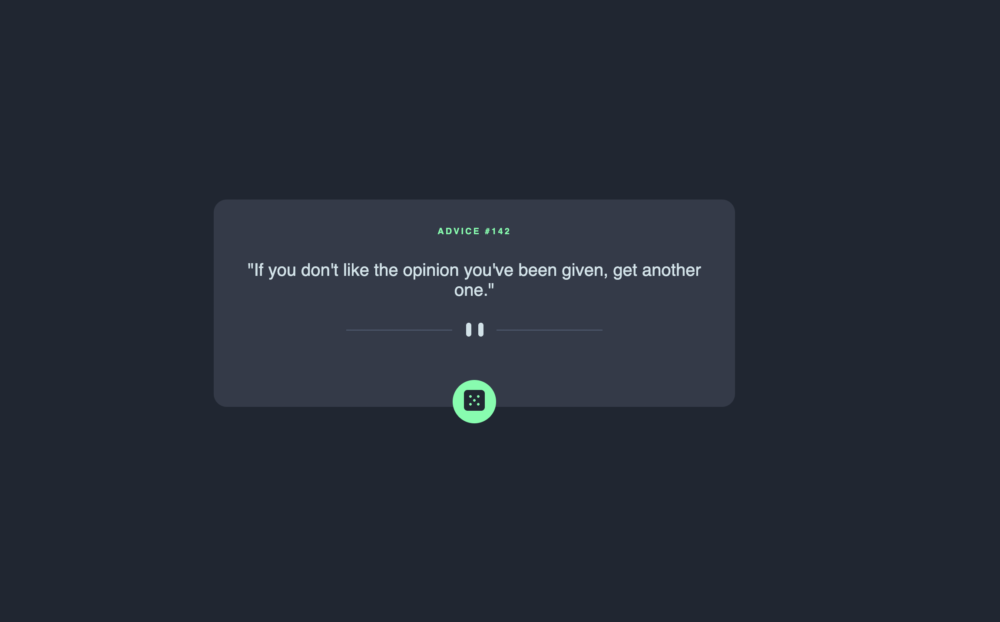
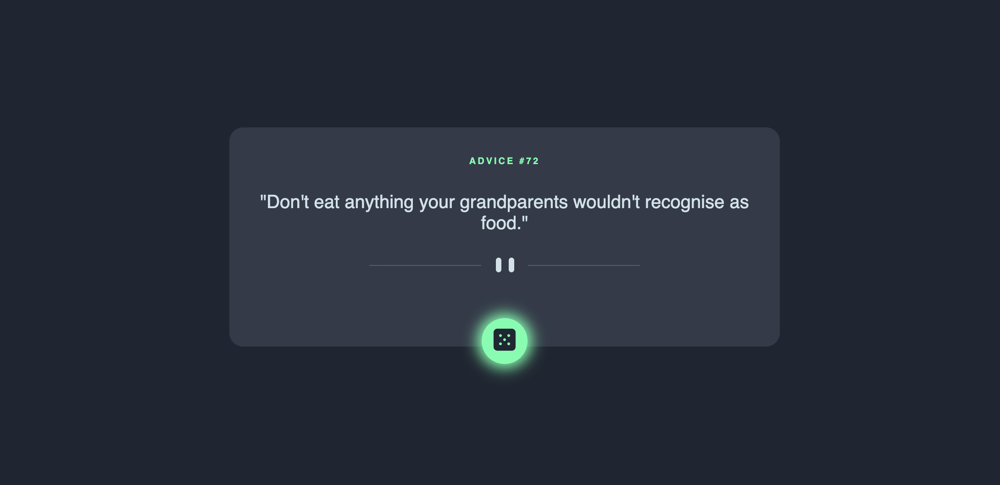

# Frontend Mentor - Advice generator app solution

This is a solution by [Sally Sghair](https://github.com/sallyali7) to the [Advice generator app challenge on Frontend Mentor](https://www.frontendmentor.io/challenges/advice-generator-app-QdUG-13db). 

## Table of contents

- [Overview](#overview)
  - [The challenge](#the-challenge)
  - [Screenshot](#screenshot)
  - [Links](#links)
  - [Built with](#built-with)
- [Author](#author)

## Overview

### The challenge

I built this Web-App which consumes a 3rd party api and displays the relevant information as dicatated. The app is responsive and to my best ability matched the original design. The user is given a random advices displayed on the advice card, they can view more by clicking on the dice button which will generate a new advice. 

### Screenshot 



Active state




### Links

- Solution URL: [https://github.com/sallyali7/daily_advice_app](https://your-solution-url.com)
- Live Site URL: [Live Site](https://frabjous-lily-4d6b8b.netlify.app)

### Built with

- Semantic HTML5 markup
- CSS custom properties
- Flexbox
- CSS Grid
- Mobile-first workflow
- [React](https://reactjs.org/) - JS library
- [Axios](https://axios-http.com) - JS Library

### Code snippets

To see how you can add code snippets, see below:

```js
const [advice, setAdvice] = useState({})

  const getAdvice = async () => {
    try {
      const response = await axios.get(`https://api.adviceslip.com/advice`)
      const advice = response.data.slip
      setAdvice(advice)
    } catch (err) {
      console.log(err)
    }
  }

  console.log(advice)

  useEffect(() => {
    getAdvice()
  }, [])
```

## Author

- Website - [Sally Sghair](www.sallysghair.com)
